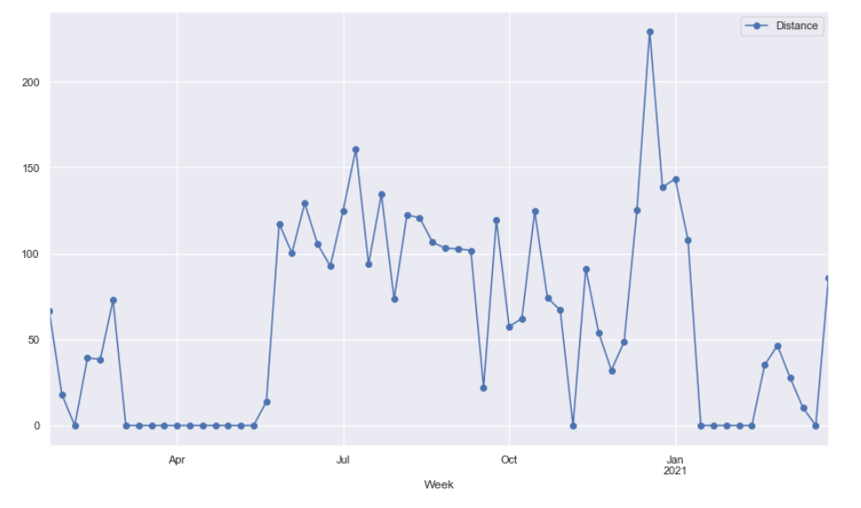
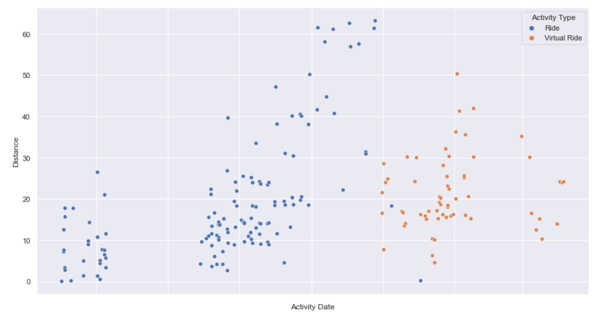
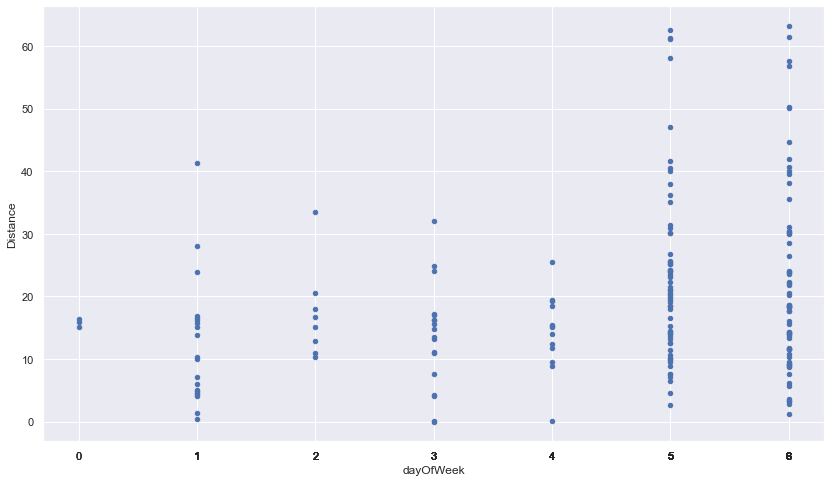
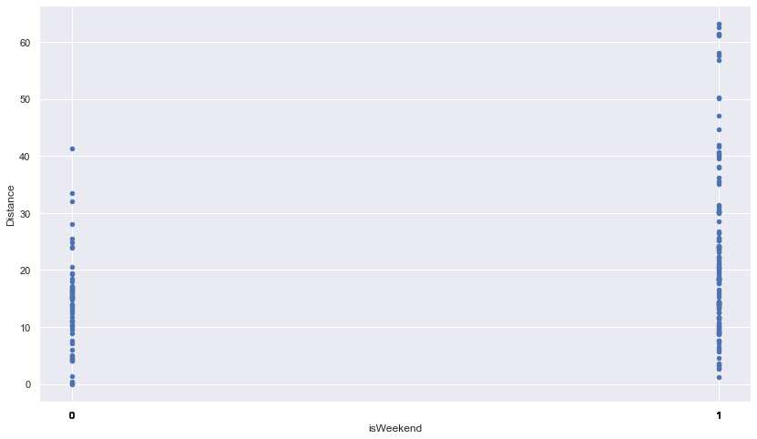
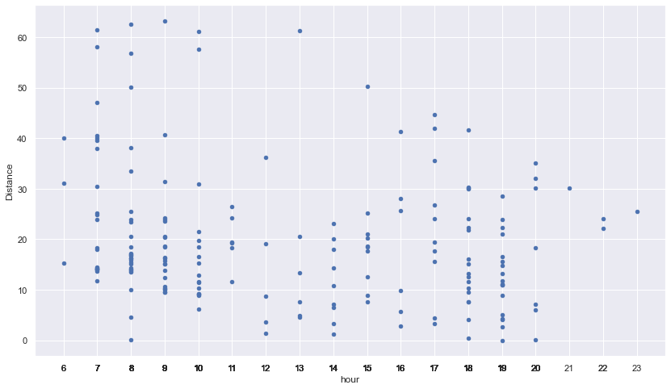
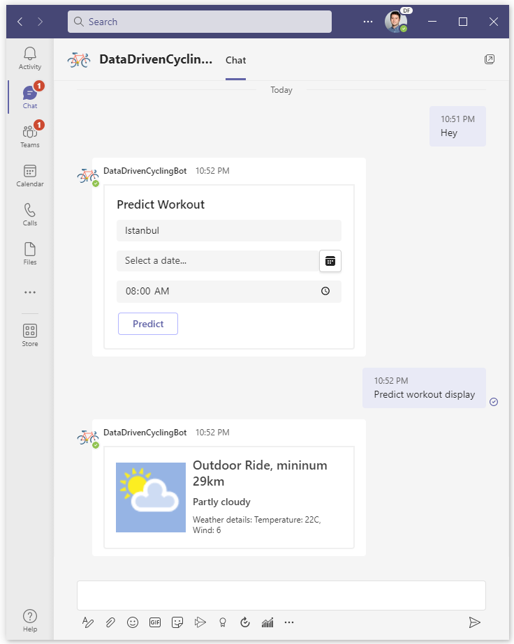

# Data-Driven Cycling and Workout Prediction

 In this repo I'll share how I turned data from my bike exercises into a Machine Learning based smart chat bot leveraging Microsoft Bot Framework and Microsoft Teams, which helps me achieve more with my training and be motivated all the time.

## Overview

I started cycling with a foldable bike at end of January 2020 and I fell in love with cycling. I also love working with data so I've recorded all my rides to [Strava](www.strava.com) with [Withings Steel HR](https://www.withings.com/us/en/steel-hr) smart watch. 🚴🏻🚴🏻

At the end of May I upgraded my city bike to a Gravel bike. I had great time with my new bike with outdoor activities until autumn.


After exercising outside with nice weather, for cold weather I setup a pain-cave at my home for virtual rides on [Zwift](www.zwift.com) using [Elite Arion AL13 roller](https://www.elite-it.com/en/products/home-trainers/rollers/arion) with [Misuro B+ sensor](https://www.elite-it.com/en/products/home-trainers/sensors/misuro-b). Zwift is a virtual environment where you connect with your 3D avatar to ride with other athletes real-time.


My Zwift account is connected with Strava to collect all my ride data, and I’ve completed **“3700km”** so far combining outdoor and indoor activities 🎉🎉

I've decided to analyze my data and after analyzing I've decided to take this to the next level with my engineering capabilities.

This repo shows how to analyze your Strava data and visualize it using Jupyter Notebooks. Furthermore, this project aims to predict potential workout days and distance to find an optimal workout routine using your own data. This digital personal trainer can be used as a workout companion.

This project first started as a data discovery of existing bulk data on Jupyter Notebook. During data exploration phase I saw some patterns and thought that, these patterns could help me get back in shape again. Shortly after, I've decided to build a predictive model to predict my workout, `ride type` and  `distance` values. To use the prediction model within a bot framework, the model is exported as pickle file, a FastAPI based app serves the model in Python and a chat bot on Microsoft Teams calling this API help me to provide some inputs and then retrieve prediction.


## Data Discovery - Highlights

Let's have a look at some highlights I achieved so far, here are some highlights about my data.

1. In 1 year, I've completed around **3700 km** including outdoor and indoor workout activities. Around 1/3 are virtual rides on Zwift.

    

2. In 2019, I gained some fat, but as a result of my physical activities and some healthy food, I lost ~13kgs (~28lbs) during this time.

    

3. I love below weekly graph showcasing all important life events happened in one year.

    * Jan-Mar: A lot of a passion for workout
    * April-June: Pandemic and lockdown in Turkey
    * June-December: Enjoying riding outdoor and indoor
    * December: new year break challenge #Rapha500
    * Jan: Blessed with a new family member :)
    * Jan - March: Trying to find my old routine again, last but not least decided to build a digital personal trainer.

    

4. So far, my longest distance in one ride is 62km, and I love this graph showing my performance over time;

    

## Correlation

While I was checking ride types, I realized that after a certain point I only switched to Indoor Virtual Ride and I wanted to see if there's a correlation between selecting indoor rides and the weather, specifically with `Wind` and `Temperature`. For that I used a Weather API to retrieve Weather condition during my workouts and results were clear; I don't like cycling at cold, rainy weathers, so after a point I switched back to just Indoor Virtual Rides. The graph below shows that below a certain temperature, I picked Indoor Ride. This is one of the features - I have added into my model for prediction.


## Feature Engineering

I spent some time to visualize my ride data using Jupyter Notebook and I found some patterns. These patterns were either conscious decisions by me or some decisions due to conditions.

I decided to do an exercise on [Feature Engineering](https://en.wikipedia.org/wiki/Feature_engineering)

### 1. Ride Type

Ride type is a factor for impacting the duration and day of the training , so  I added a flag to signify whether a ride is a outdoor or indoor

* `rideType` - boolean flag

### 2. Weather Condition

As mentioned in the [correlation](#correlation), weather is one of the factors that affect my workout plan:

* `Temperature` - Celsius value as integer
* `Wind` - km/h value as integer
* `Weather Description` - Description if weather is cloudy, sunny, rainy etc.

### 3. Day of the Week and Weekend

When I plotted the distance vs. weekend or weekdays, I found that my longest rides were on the weekend. Public holidays were another factor but for now, I've decided not to integrate those.

* `DayOfWeek` - integer

  

But mostly I picked Tuesday and Thursday as weekday short ride days, and decided to add week of the day as a feature and use weekends as flag based on below graph

* `isWeekend` - boolean flag

  

### 4. Hour of the Day

In hot summer days, I prefer early outdoor rides when the temperature is cooler than noon time. Based on the following plot, the hour of the day is effecting my ride and ride type as well so I've decided to add a feature for hour of the day

* `hour` - integer

  

## Prediction Models

For my personal need and following the data analysis I wish to have a prediction which outputs the `distance`, i.e. how many kilometers I'm expected to ride and the `ride type`, i.e. whether the planned ride is indoor or outdoor.

Therefore, I used the previous data analysis and engineered features to create a prediction model for `Distance` and `Ride Type`.

### 1. Ride Type Prediction

For mental preparation, there are differences between riding indoor and outdoor, so generally I do prepare myself and my ride equipment the day before my workout based on my ride type. I do prefer going outside however I don't like rainy and cold weather. In addition, I'd like to find the optimal the ride for my workout.

This choice is also affecting my distance and hour of workout.
Since it's a classification problem, I have decided to pick `Logistic Regression` for predicting the ride type.

Set training data:

### 2. Distance Prediction

Every week, I set weekly distance goals I'd like to complete. The decision is also affected by external factors such as at "what time of the day?", "How is the weather?", "Is it hot outside or cold outside?", "Is it windy?", "Is it weekend or a weekday?"

Given these factors, I'd like to predict my expected ride distance. This is a `Regression` problem and I've decided to pick `Linear Regression` for distance prediction.

For both models (predicting **distance** and **ride type**), here are the engineered features I've decided to use in my models:

> `['hour','dayOfWeek','isWeekend','temp','wind','weather']`

While I have decided to pick `Logistic Regression` for ride type and `Linear Regression` for distance, there could be more accurate models. The process of developing these models, is iterative and often requires more ride data, so this is just first step.

There is a nice [Machine Learning algorithm cheat sheet](https://docs.microsoft.com/en-us/azure/machine-learning/algorithm-cheat-sheet). You can learn more about ML algorithms and their applications.

## Model Training

For workout prediction, Machine Learning model training is added into [7 - b Predict Workout Model Training.ipynb](notebooks/7%20-%20b%20Predict%20Workout%20Model%20Training.ipynb) Jupyter notebook. Here are some steps covering steps to train a model:

First I set training data with selected features (X):

```python
# select features as list of array
X = data[['hour','dayOfWeek','isWeekend','temp','wind','weather']]
X = X.to_numpy()
```

Then I create the training data's labels (Y):

```python
# set Distance values
Y_distance = data['Distance']
Y_distance = Y_distance.to_numpy()

# set Ride Type Values
Y_rideType = data['rideType']
Y_rideType = Y_rideType.to_numpy()
```

1. **Logistic Regression for RideType Prediction**

    For logistic regression I am providing all data for training and fit my final model. The model uses following features `['hour','dayOfWeek','isWeekend','temp','wind','weather']`.

    Training data features:
    * `hour` - value between `0 - 23`
    * `dayOfWeek` - value between `0 - 6`
    * `isWeekend` - for weekdays `0`, for weekend `1`
    * `temp` - integer temperature value in Celsius
    * `wind` - integer wind value in km/h
    * `weather` - weather description provided by Weather API

    Training prediction value:
    * `rideType` - for outdoor cycling `0`, for indoor cycling `1`

    ```python
    # import Logistic Regression from sci-kit learn
    from sklearn.linear_model import LogisticRegression

    # select training data and fit final model
    model_lr = LogisticRegression(random_state=0).fit(X, Y_rideType)

    # test prediction with a clear sunny Sunday weather data
    result_ridetype = model_lr.predict([[8,6,1,20,3,0]])
    print("Result type prediction=%s" % result_ridetype)

    # test prediction with a cold Sunday weather data
    result_ridetype = model_lr.predict([[8,6,1,10,12,1]])
    print("Result type prediction=%s" % result_ridetype)
    ```

2. **Linear Regression for distance prediction**

    For prediction model I have total 168 workout data and I would like to use 160 of them as training data and 8 of them as test data.

    Training data features:
    * `hour` - value between `0 - 23`
    * `dayOfWeek` - value between `0 - 6`
    * `isWeekend` - for weekdays `0`, for weekend `1`
    * `temp` - integer temperature value in Celsius
    * `wind` - integer wind value in km/h
    * `weather` - weather description provided by Weather API

    Training prediction value:
    * `distance` - distance value in kilometers.

    ```python
    # import Linear Regression from sci-kit learn
    from sklearn.linear_model import LinearRegression
    from sklearn.utils import shuffle
    
    # select training data and fit final model
    model = LinearRegression()
    model.fit(X, Y_distance)
    
    # test prediction with a clear sunny Monday weather data
    result_distance = model.predict([[8,0,1,20,3,0]])
    print("Result distance prediction=%s" % result_distance)
    
    # test prediction with a cold Sunday weather data
    result_distance = model.predict([[8,6,1,10,12,1]])
    print("Result distance prediction=%s" % result_distance)
    ```

3. **Export models as pickle file**

    At this phase the trained models are exported as pickle files to be used via a web API. The web API is consuming data from a Weather API, collects necessary data features for prediction and outputs the prediction to the user.

    ```python
    # import pickle library
    import pickle
    
    # save distance model file in the model folder for prediction
    distance_model_file = "../web/model/distance_model.pkl"
    with open(distance_model_file, 'wb') as file:
        pickle.dump(model, file)
    
    # save ride type model file in the model folder for prediction
    ridetype_model_file = "../web/model/ridetype_model.pkl"
    with open(ridetype_model_file, 'wb') as file:
        pickle.dump(clf, file)
    ```

## Solution

This is an end-to-end solution, using Strava workout data exports as input. Strava contains indoor and outdoor workout ride data. To analyze the data, Jupyter Notebooks are used for `Data Cleaning`, `Data Pre-Processing`, `Model Training` and `Model Export. For machine learning model training and prediction, the scikit-learn Python package is used. The prediction model is exported by scikit-learn to predict my ride type and distance of my workout.

The model, as a pickle file is hosted through FastAPI app which provides an API to pass parameters and predict weather information using 3rd party weather API.  These values are used by the model for prediction.

As a user interface, I've created a Conversational AI project using Microsoft Bot Framework to communicate with Fast API. I picked Microsoft Teams as canvas, since this is the platform I use regularly to communicate.

With this solution I now can select my city, workout date and time, and I get a prediction providing `distance` and `ride type` values.

### Architecture


Folder Structure:

* `bot` - Bot application to retrieve prediction model
* `data` - Data folder contains Strava output
* `notebooks`
  * `1 - GPX Analysis.ipynb`
  * `2 - Prepare Data.ipynb`
  * `3 - Total Distance Analysis.ipynb`
  * `4 - GPX Anlaysis Combined.ipynb`
  * `5 - GPX Analysis Visualization.ipynb`
  * `6 - Interactive Dashboard.ipynb`
  * `7 - Predict Workout Model.ipynb`
  * `8 - Predict Workout.ipynb`
  * `9 - Present.ipynb` - Highlight for data analysis and results
* `web` - FastAPI for prediction model
  * `model` - Contains models for prediction
  * `app.py` - FastAPI web app for prediction model
  * `myconfig.py` - Environmental variables
  * `utils.py` -  Common utility functions

## Run the Project

In this sample, Python 3.8.7 version is used, to run the project.

1. Create virtual environment

    ```bash
    python -m venv .venv
    ```

1. Activate your virtual environment for Mac:

    ```bash
    source ./venv/bin/activate
    ```

1. Install dependencies

    ```bash
    pip install -r notebooks/requirements.txt
    ```

1. Export your Strava Data from your profile

    * Visit [Settings > My Account > Download or Delete Your Account](https://www.strava.com/account)
    * Click `Download Request (optional)`
    * Download zip file to export into `Data` folder.

1. Create a `Data` folder and export your Strava Data into this folder.

1. Run `Jupyter Notebook` in your local

    ```bash
    jupyter notebook
    ```

## Weather API

Weather data was not available to [correlate](#correlation) with my workouts, so I've used a weather API to extract weather information for my existing workout days. I've used [WorldWeatherOnline API](https://www.worldweatheronline.com/developer/) for the latest weather forecasts for my ride locations. This API also offers weather forecasts up to 14 days in advance, hourly forecasting and weather warnings so this is very helpful for my prediction API as well.

## Python FastAPI Web Application for API

Run Python FastAPI for running on your local machine

```bash
cd web
```

```bash
python app.py
```

### Test endpoint

* Predict Ride Type & Distance

    [http://127.0.0.1:8000/predict?city=Istanbul&date=2021-04-10&time=14:00:00](http://127.0.0.1:8000/predict?city=Istanbul&date=2021-04-10&time=14:00:00)

## Publish Web App

Publish Python FastAPI to Azure Web App service

```bash
cd web
az webapp up --sku B1 --name data-driven-cycling
```

Update startup command on Azure Portal,  
Settings > Configuration > General settings > Startup Command

```bash
gunicorn -w 4 -k uvicorn.workers.UvicornWorker main:app
```

to re-deploy and update existing application:

```bash
az webapp up
```

## Test Bot Application on Local

Prerequisite:

* [.NET Core SDK](https://dotnet.microsoft.com/download) version 3.1

```bash
cd bot
dotnet run
```

Or from Visual Studio

* Launch Visual Studio
* File -> Open -> Project/Solution
* Navigate to `bot` folder
* Select `CyclingPrediction.csproj` file
* Update your api url in `Bots/Cycling.cs`
  * If you would like to test with your local Web API change to your local endpoint such as:

    ```csharp
    string RequestURI = String.Format("http://127.0.0.1:8000/predict?city={0}&date={1}&time={2}",wCity,wDate,wTime);
    ```

  * If you'll test with your Azure Web API change to your azure endpoint such as:

    ```csharp
    string RequestURI = String.Format("https://yourwebsite.azurewebsites.net/predict?city={0}&date={1}&time={2}",wCity,wDate,wTime);
    ```

* Press `F5` to run the project

* Your bot service will be available at [https://localhost:3979](https://localhost:3979). Run your Bot Framework Emulator and connect to [https://localhost:3979](https://localhost:3979) endpoint

    

After that your bot is ready for interaction.

## Bot on Microsoft Teams

After you publish the bot you can connect with different conversational UI. I've connected with Microsoft Teams and named as `Data Driven Cycling Bot`.

Once you send first message, it's sending a card to pick `City`, `Date` and `Time` information to predict workout ride type and minimum distance.



## Conclusion

This has been a personal journey to discover insights from my existing data, then it turned out to a digital personal trainer.

For next steps I would like to focus on,

* Setting a weekly target and predicting workout schedule for the week based on my target.
* Compare ride metrics and see the improvement over time.
* Supporting US metrics (now only supports km)
