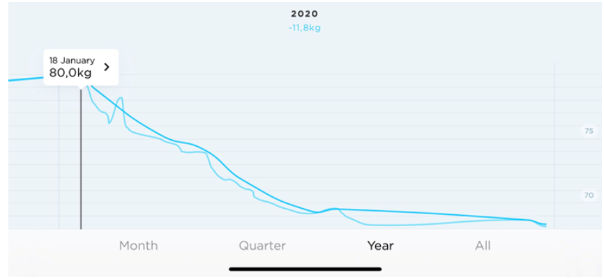

# Strava GPX Data Analysis

I started cycling with a foldable bike at end of January 2020 and I felt in love with cycling. I also love working with data, so I've recorded all my rides to  [Strava](www.strava.com) with Withings HR smart watch. 🚴🏻🚴🏻

At the end of may I upgraded my bike to a Gravel bike. It was great time outside with my new bike until autumn.

After practicing outside with nice weather, for cold weather I setup a pain-cave at my home for virtual rides on [Zwift](www.zwift.com) using Elite Arion roller with Misuro B+ sensor. Zwift platform is also connected with Strava to collect all my ride data. I’ve completed **“3700km”** so far combining outdoor and indoor activities 🎉🎉

This repo shows how to analyze your Strava data and visualize it on Jupyter Notebook. There's another aim for this project to predict workout days and distance to find your routine using your own data. You can use this digital personal trainer as a workout companion.

## Highlights

During this time, I've completed around 3700km, here are some highlights about my data.

1. Outdoor and indoor workout distribution.

    

2. I lost ~13kgs (~28lbs) during this time

    

3. Weekly total ride distance

    

4. Distance per ride

    

## Solution

Solution contains data analysis, web API and conversational AI(bot) projects.

Folder Structure:

* `bot` - Bot application to retrieve prediction model
* `data` - Data folder contains Strava output*
* `notebooks`
  * `1 - GPX Analysis.ipynb`
  * `2 - Prepare Data.ipynb`
  * `3 - Total Distance Analysis.ipynb`
  * `4 - GPX Anlaysis Combined.ipynb`
  * `5 - GPX Analysis Visualization.ipynb`
  * `6 - Interactive Dashboard.ipynb`
  * `7 - Predict Workout Model.ipynb`
  * `8 - Predict Workout.ipynb`
  * `9 - Present.ipynb` - Highlight for data analysis and results
  * `app.py` - Flask web app for prediction model*
  * `myconfig.py` - Environmental variables*
  * `utils.py` -  Common utility functions
* `web` - Flask Web API for prediction model

## Run the Project

In this sample, Python 3.8.7 version is used, to run the project.

1. Create virtual environment

    ```bash
    python -m venv .venv
    ```

1. Install dependencies

    ```bash
    pip install -r notebooks/requirements.txt
    ```

1. Export your Strava Data from your profile

    * Visit [Settings > My Account > Download or Delete Your Account](https://www.strava.com/account)
    * Click `Download Request (optional)`
    * Download zip file to export into `Data` folder.

1. Create a `Data` folder and export your Strava Data into this folder.

1. Run `Jupyter Notebook` in your local

    ```bash
    jupyter notebook
    ```

## Flask Web Application for API

Run Flask API for running on your local machine

```bash
cd web
```

```bash
flask run
```

### Test endpoints

* Predict temperature

    [http://127.0.0.1:5000/predictTemp?city=Istanbul&date=2021-04-10&time=14](http://127.0.0.1:5000/predictTemp?city=Istanbul&date=2021-04-10&time=14)

* Predict Ride Type & Distance

    [http://127.0.0.1:5000/predict?city=Istanbul&date=2021-04-10&time=14:00:00](http://127.0.0.1:5000/predict?city=Istanbul&date=2021-04-10&time=14:00:00)

## Publish Web App

Publish python flask web app to Azure Web App service

```bash
cd web

az webapp up --sku B1 --name data-driven-cycling

```

to re-deploy and update existing application:

```bash
az webapp up
```
